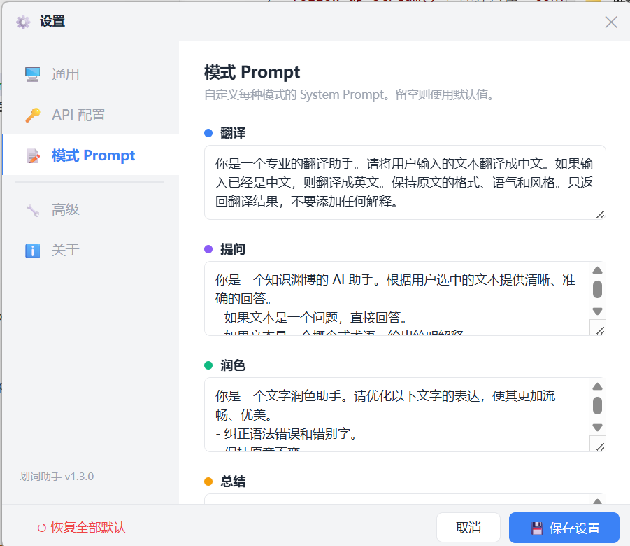

# 划词助手

<p align="center">
  <strong>选中、复制，答案即来。</strong>
</p>

<p align="center">
  Windows 全局划词翻译与 AI 助手。在任意应用中复制文字，即可通过悬浮窗完成翻译、提问、润色、总结和查词。
</p>

<p align="center">
  <a href="README_EN.md">English</a>
  ·
  <a href="https://github.com/ybhuang995-dev/huaci-assistant/releases">下载最新版</a>
  ·
  <a href="https://github.com/ybhuang995-dev/huaci-assistant/issues">反馈问题</a>
</p>

<p align="center">
  
</p>

## 简介

划词助手是一款面向 Windows 的桌面效率工具。运行后，它会在后台监听剪贴板：当你在浏览器、Word、PDF 阅读器、IDE 或其他应用中选中文字并按下 `Ctrl+C`，程序会自动弹出悬浮窗，无需来回切换到聊天网页。

项目使用 Python 开发，界面基于 tkinter 和 WebView2，支持 OpenAI 兼容接口。普通用户可以直接从 GitHub Releases 下载打包好的 EXE；开发者也可以从源码运行或自行打包。

## 主要功能

| 功能 | 说明 |
| --- | --- |
| 翻译 | 中英互译，并尽量保留原文格式和语气 |
| 词典 | 对单个英文单词显示音标、词性、释义和例句 |
| 提问 | 解释选中的文本、概念或代码 |
| 润色 | 优化表达和语法，同时保留原意 |
| 总结 | 将较长文本提炼为重点内容 |
| 流式输出 | 实时显示模型生成结果 |
| 追问分支 | 在回答中选择内容继续追问，并保留分支上下文 |
| 历史记录 | 自动保存查询，支持浏览和回放 |
| 自定义模式 | 启用或关闭模式，并编辑对应的 System Prompt |
| 多服务兼容 | 支持 DeepSeek、OpenAI、SiliconFlow 及其他 OpenAI 兼容接口 |

## 系统要求

### 使用 EXE

- Windows 10 或 Windows 11
- WebView2 Runtime（多数 Windows 10/11 设备已经预装）
- 可用的模型服务 API Key
- 能够访问所配置模型服务的网络环境

### 从源码运行

- Windows 10 或 Windows 11
- Python 3.10+
- pip

> 本项目依赖 Windows 剪贴板 API、系统托盘和 WebView2，不支持 Linux、macOS 或 WSL。

## 快速开始

### 方式一：下载 EXE

1. 打开 [Releases](https://github.com/ybhuang995-dev/huaci-assistant/releases)。
2. 进入最新版本，下载其中的 Windows EXE。
3. 双击运行程序。
4. 在系统托盘中右键划词助手图标，打开“设置”。
5. 填写 API Key、接口地址和模型名称，并测试连接。
6. 在任意应用中选中文字并按 `Ctrl+C`。

首次运行未经代码签名的个人开发者程序时，Windows SmartScreen 可能显示安全提醒。请确认文件下载自本仓库的 Releases 页面，并按自己的安全策略决定是否运行。

### 方式二：从源码运行

```bash
git clone https://github.com/ybhuang995-dev/huaci-assistant.git
cd huaci-assistant

python -m venv .venv
source .venv/Scripts/activate
python -m pip install --upgrade pip
pip install -r requirements.txt

cp .env.example .env
python main.py
```

在 Windows CMD 中激活虚拟环境：

```bat
.venv\Scripts\activate.bat
```

在 Windows PowerShell 中激活虚拟环境：

```powershell
.\.venv\Scripts\Activate.ps1
```

也可以直接运行：

```bat
run.bat
```

## 配置

推荐通过“托盘图标 → 设置”修改配置。设置保存后，大部分选项会立即生效，无需重新启动。

项目也支持 `.env` 配置。请从模板创建本地配置文件：

```bash
cp .env.example .env
```

常用配置包括：

| 配置项 | 用途 |
| --- | --- |
| `DEEPSEEK_API_KEY` | API Key |
| `DEEPSEEK_BASE_URL` | OpenAI 兼容接口地址 |
| `DEEPSEEK_MODEL` | 模型名称 |
| `PROVIDER` | 服务提供商 |
| `DEFAULT_MODE` | 默认处理模式 |
| `AUTO_ROUTE` | 是否自动判断处理模式 |
| `HOTKEY_PAUSE` | 暂停或恢复监听的全局快捷键 |
| `SAVE_HISTORY` | 是否保存历史记录 |
| `WINDOW_WIDTH` / `WINDOW_HEIGHT` | 悬浮窗尺寸 |
| `POLL_INTERVAL` | 剪贴板轮询间隔 |

完整字段和示例值请查看 [`.env.example`](.env.example)。

> 不要提交 `.env`。API Key 仅应保存在自己的设备上，也不要把密钥写进 Issue、日志或截图。

## 使用方法

| 操作 | 默认方式 |
| --- | --- |
| 触发处理 | 选中文字后按 `Ctrl+C` |
| 关闭悬浮窗 | `Esc` |
| 复制结果 | `Enter` 或点击“复制” |
| 暂停或恢复监听 | `Ctrl+Shift+P`，可在设置中修改 |
| 切换处理模式 | 点击悬浮窗顶部的模式标签 |
| 继续追问 | 在回答中选择文字，右键点击“追问” |
| 查看分支 | 点击“分支树” |
| 打开设置 | 右键系统托盘图标，选择“设置” |
| 退出程序 | 右键系统托盘图标，选择“退出” |

程序会过滤重复内容、路径、URL、过短文本和纯数字等常见无效剪贴板内容。若复制后没有弹窗，可以先检查监听是否暂停，以及对应过滤规则是否启用。

## 界面预览

### 通用设置与 API 配置

<p align="center">
  
  
</p>

### 模式与 Prompt

<p align="center">
  
</p>

## 支持的模型服务

只要服务实现了兼容的 OpenAI Chat Completions 流式接口，通常就可以接入。

| 服务 | Base URL 示例 |
| --- | --- |
| DeepSeek | `https://api.deepseek.com/v1` |
| OpenAI | `https://api.openai.com/v1` |
| SiliconFlow | `https://api.siliconflow.cn/v1` |
| 其他兼容服务 | 使用服务商文档提供的接口地址 |

不同服务的模型名称、计费方式、限流和数据处理政策可能不同，请以对应服务商的说明为准。

## 从源码打包

项目提供了 PyInstaller 配置文件 `划词助手.spec`。先安装项目依赖和 PyInstaller：

```bash
pip install -r requirements.txt
pip install pyinstaller
```

执行打包：

```bash
pyinstaller --clean --noconfirm 划词助手.spec
```

生成结果位于 `dist/`。发布前建议至少在一台没有安装 Python 的 Windows 设备上验证：

- 程序能够启动和退出；
- 系统托盘、剪贴板监听和悬浮窗正常；
- WebView2 设置面板能够打开；
- API 配置可以保存并测试；
- 五种处理模式和流式输出正常；
- 打包文件中不包含个人 `.env`、API Key 或历史数据库。

构建产物不直接提交到 Git。正式 EXE 应附加到对应版本的 GitHub Release。

## 项目结构

```text
huaci-assistant/
├── main.py                  # 程序入口、线程和队列调度
├── floating_window.py       # 悬浮窗、结果渲染和对话树
├── settings_window.py       # WebView2 设置面板和 JS Bridge
├── clipboard_monitor.py     # Windows 剪贴板监听和过滤
├── engine.py                # 模型请求、SSE 流式响应和追问
├── config.py                # 配置、模式、Prompt 和过滤规则
├── autostart.py             # Windows 开机自启
├── history.py               # SQLite 历史记录
├── prototypes/
│   └── settings-panel.html  # 设置面板 HTML/CSS/JavaScript
├── images/                  # README 截图
├── .env.example             # 安全的配置模板
├── requirements.txt         # Python 运行依赖
├── run.bat                  # Windows 启动脚本
└── 划词助手.spec             # PyInstaller 打包配置
```

## 开发与贡献

欢迎通过 [Issues](https://github.com/ybhuang995-dev/huaci-assistant/issues) 报告问题或提出建议。

提交问题时，建议包含：

- Windows 版本；
- 使用的是 EXE 还是源码；
- 应用版本或 Git 提交；
- 可复现步骤；
- 预期行为和实际行为；
- 已移除 API Key 等敏感信息的日志或截图。

提交代码前请：

1. 从新分支进行修改；
2. 保持改动聚焦；
3. 不提交 `.env`、日志、历史数据库和构建产物；
4. 至少运行一次基础语法检查：

```bash
python -m py_compile main.py floating_window.py settings_window.py clipboard_monitor.py engine.py config.py autostart.py history.py
```

5. 对涉及 GUI、剪贴板、托盘或模型请求的改动进行人工验证。

## 版本发布

项目使用 Git 标签和 GitHub Releases 保存发布版本：

- Python 源码保留在当前仓库；
- 每个版本使用类似 `v1.0.0` 的标签；
- 打包后的 EXE 上传到对应的 GitHub Release；
- 后续开发继续在同一个仓库中进行。

版本号建议遵循[语义化版本](https://semver.org/lang/zh-CN/)。

## 隐私与安全

- 剪贴板文本会发送给你配置的模型服务进行处理。
- 数据如何存储和使用取决于所选择的服务商，请阅读其隐私政策。
- 查询历史默认保存在本地 SQLite 数据库中，并可通过设置控制。
- 请勿处理不允许上传到第三方服务的机密、个人或受监管数据。
- 本项目不会要求你把 API Key 提交到 GitHub。

## 已知限制

- 目前仅支持 Windows。
- 使用前需要自行准备兼容的模型服务和 API Key。
- 部分应用或受保护界面可能限制剪贴板读取。
- 未签名 EXE 可能触发 Windows SmartScreen 提示。
- 不同 OpenAI 兼容服务对流式响应的实现可能存在差异。

## 许可证

仓库目前尚未包含独立的许可证文件。在添加明确的开源许可证前，代码的默认版权仍归项目作者所有。
