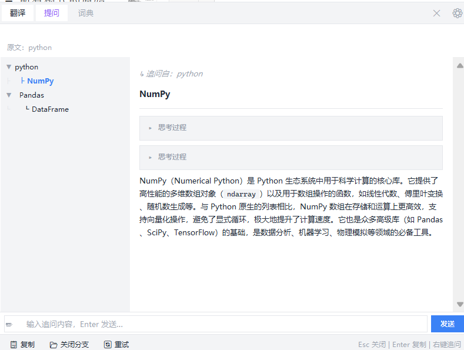
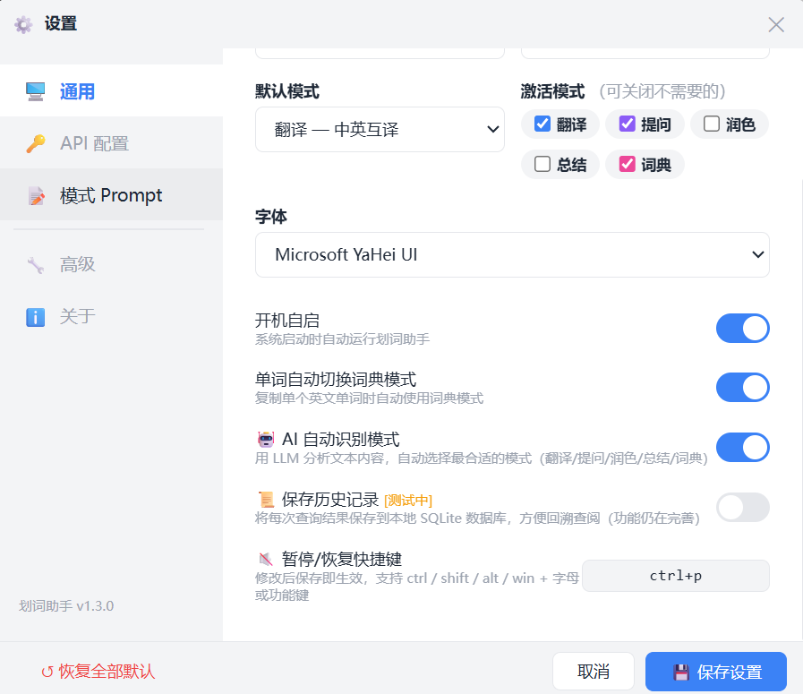
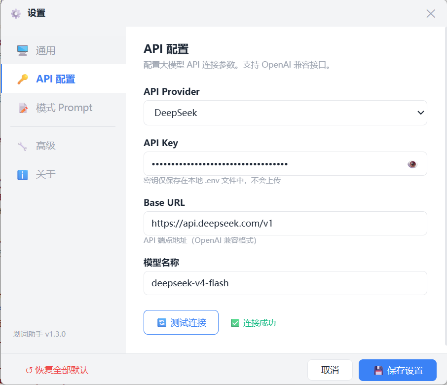

# 划词助手

> **复制即翻译**——你本来就要 Ctrl+C，多一步都不需要。

在任何应用中选中文字、按 `Ctrl+C` 复制，悬浮窗自动弹出，翻译或 AI 回答已经在里面了。

## 预览

<p align="center">
  
</p>

## 功能

- **🌐 翻译** — 中英互译，保留原文格式
- **📖 词典** — 检测到单个英文单词时自动显示音标、词性、释义、例句
- **💡 提问** — 选中文字即可向 AI 提问，支持代码解释
- **✨ 润色** — 优化表达，修正语法，不改变原意
- **📝 总结** — 提取 3–5 个关键要点，快速消化长文
- **🤖 自动路由** — LLM 判断文本类型，自动选择最合适的处理模式
- **💬 追问** — 在回答中划选文字一键追问，支持多轮对话树
- **📂 历史记录** — 自动保存查询历史，可回放追溯
- **🔌 多提供商** — 支持 DeepSeek、OpenAI 及所有 OpenAI 兼容 API

## 快速开始

### 前提条件

- Windows 10 或更高版本
- Python 3.10+
- 一个 API Key（[DeepSeek 免费注册](https://platform.deepseek.com/api_keys)，或 OpenAI 及其他兼容 API 均可）

### 安装与运行

```bash
# 1. 克隆
git clone https://github.com/ybhuang995-dev/huaci-assistant.git
cd 划词助手

# 2. 安装依赖
pip install -r requirements.txt

# 3. 配置 API Key
cp .env.example .env
# 打开 .env，把 DEEPSEEK_API_KEY=your_key_here 替换为你的真实 Key

# 4. 启动
python main.py
# 或直接双击 run.bat
```

启动后任务栏右下角出现托盘图标 🅐。右键可暂停/恢复监听、打开设置、退出。

## 使用方式

1. 在任意应用中**选中文字**，按 **Ctrl+C**
2. 悬浮窗自动弹出，显示翻译或 AI 回答
3. 点击顶部标签切换模式（翻译 / 提问 / 润色 / 总结 / 词典）
4. 在回答中划选文字 → 右键「💬 追问」，深入提问

| 操作 | 方式 |
|------|------|
| 触发翻译 | 选中文字 + `Ctrl+C` |
| 关闭悬浮窗 | `Esc` |
| 复制结果 | `Enter` |
| 暂停/恢复监听 | `Ctrl+P`（可自定义） |
| 打开设置 | 托盘右键 → 设置 |

## 设置面板

托盘右键 → **设置**，打开 WebView2 设置面板：

<p align="center">
  
  &nbsp;
  
</p>

<p align="center">
  
</p>

可自定义的内容：

- **通用** — 窗口尺寸、默认字体、功能开关（自动路由、自动词典、开机自启、历史记录）
- **API 配置** — 切换 Provider、修改 API 地址和模型、测试连接
- **模式 Prompt** — 启用/禁用特定模式、自定义每种模式的 System Prompt

禁用某个模式后，LLM 自动路由不会选中它。

## 适配其他 API 提供商

只要 API 是 OpenAI 兼容格式即可使用。在设置面板中切换 Provider 或填入自定义地址：

| Provider | Base URL |
|----------|----------|
| DeepSeek | `https://api.deepseek.com/v1` |
| OpenAI | `https://api.openai.com/v1` |
| SiliconFlow | `https://api.siliconflow.cn/v1` |
| 自定义 | 你的兼容 API 地址 |

## 项目结构

```
划词助手/
├── main.py                  # 入口：多线程调度，剪贴板→浮窗→API 全链路
├── floating_window.py       # 悬浮窗 UI（tkinter + HtmlFrame）
├── settings_window.py       # 设置面板（pywebview + WebView2）
├── clipboard_monitor.py     # 剪贴板监听 + 智能过滤
├── engine.py                # LLM 引擎（SSE 流式 + 文本分类）
├── config.py                # 配置管理 + 模式定义
├── autostart.py             # 开机自启（注册表）
├── history.py               # SQLite 历史记录
├── prototypes/
│   └── settings-panel.html  # 设置面板 HTML/CSS/JS
├── image/                   # README 截图
├── requirements.txt
├── run.bat                  # Windows 一键启动
└── .env.example             # 配置模板
```

## 开源协议

MIT
